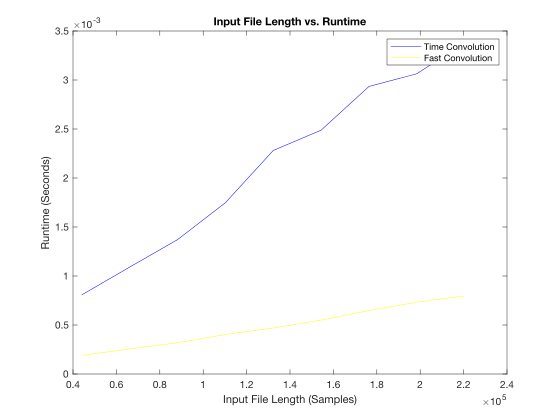

# Runtime Results

| filename           | file_length | time_conv_time | fast_conv_time | trial_number |
|--------------------|-------------|----------------|----------------|--------------|
| whitenoise1s.wav   | 44100       | 0.000832792    | 0.000215834    | 1            |
| whitenoise1s.wav   | 44100       | 0.00086675     | 0.000195666    | 2            |
| whitenoise1s.wav   | 44100       | 0.000725292    | 0.000161084    | 3            |
| whitenoise1_5s.wav | 66150       | 0.001247417    | 0.000292458    | 1            |
| whitenoise1_5s.wav | 66150       | 0.001013791    | 0.00023725     | 2            |
| whitenoise1_5s.wav | 66150       | 0.001013791    | 0.00023725     | 3            |
| whitenoise2s.wav   | 88200       | 0.001354334    | 0.000313416    | 1            |
| whitenoise2s.wav   | 88200       | 0.001356208    | 0.000326417    | 2            |
| whitenoise2s.wav   | 88200       | 0.001404667    | 0.000318334    | 3            |
| whitenoise2_5s.wav | 110250      | 0.001699458    | 0.000391459    | 1            |
| whitenoise2_5s.wav | 110250      | 0.0017555      | 0.000394083    | 2            |
| whitenoise2_5s.wav | 110250      | 0.001790792    | 0.00042425     | 3            |
| whitenoise3s.wav   | 132300      | 0.002463708    | 0.000467       | 1            |
| whitenoise3s.wav   | 132300      | 0.002033833    | 0.000472125    | 2            |
| whitenoise3s.wav   | 132300      | 0.002346917    | 0.000470333    | 3            |
| whitenoise3_5s.wav | 154350      | 0.002368792    | 0.000551084    | 1            |
| whitenoise3_5s.wav | 154350      | 0.002732292    | 0.000549625    | 2            |
| whitenoise3_5s.wav | 154350      | 0.00236425     | 0.000549625    | 3            |
| whitenoise4s.wav   | 176400      | 0.003388334    | 0.000670167    | 1            |
| whitenoise4s.wav   | 176400      | 0.0027115      | 0.000622916    | 2            |
| whitenoise4s.wav   | 176400      | 0.00270325     | 0.000650792    | 3            |
| whitenoise4_5s.wav | 198450      | 0.003091916    | 0.000707       | 1            |
| whitenoise4_5s.wav | 198450      | 0.003056625    | 0.000748916    | 2            |
| whitenoise4_5s.wav | 198450      | 0.00304375     | 0.000742875    | 3            |
| whitenoise5s.wav   | 220500      | 0.003389875    | 0.000783       | 1            |
| whitenoise5s.wav   | 220500      | 0.003382208    | 0.000782834    | 2            |
| whitenoise5s.wav   | 220500      | 0.00338025     | 0.000822625    | 3            |

# MATLAB Plot



# MATLAB Code

<details>

<summary>

</summary>

``` matlab
T = readtable("results.csv");
file_lengths = T.file_length;
time_conv_times = T.time_conv_time;
fast_conv_times = T.fast_conv_time;
previous_file_length = 0;
average_time = 0.0;
average_fast_time = 0.0;
average_count = 0;
file_lengths_unique = [];
time_conv_times_unique = [];
fast_conv_times_unique = [];
for i = 1:length(file_lengths)
    if (file_lengths(i) ~= previous_file_length) && (previous_file_length ~= 0)
        file_lengths_unique = [file_lengths_unique, previous_file_length];
        time_conv_times_unique = [time_conv_times_unique, average_time / average_count];
        fast_conv_times_unique = [fast_conv_times_unique, average_fast_time / average_count];
        average_time = 0.0;
        average_fast_time = 0.0;
        average_count = 0;
    end
    average_count = average_count + 1;
    average_time = average_time + time_conv_times(i);
    average_fast_time = average_fast_time + fast_conv_times(i);
    previous_file_length = file_lengths(i);
end
file_lengths_unique = [file_lengths_unique, previous_file_length];
time_conv_times_unique = [time_conv_times_unique, average_time / average_count];
fast_conv_times_unique = [fast_conv_times_unique, average_fast_time / average_count];
plot(file_lengths_unique, time_conv_times_unique,'blue')
hold on;
plot(file_lengths_unique,fast_conv_times_unique,'yellow')
title('Input File Length vs. Runtime')
xlabel('Input File Length (Samples)')
ylabel('Runtime (Seconds)')
legend('Time Convolution', 'Fast Convolution')
```

</details>

# Conclusion

As observed from the following plot, the regular time convolution looks like it runs at O(N) or linear time for the observed range of inputs. However, since there is two for loops in the Rust code, it's likely for larger inputs this would approach O(N\^2). For the frequency-based or fast convolution in yellow, the observed behavior is O(Nlog(N)). This is fascinating because while the Rust code includes three for loops for the frequency-based convolution, it seems this operation is more efficient because of how everything operates in blocks.
